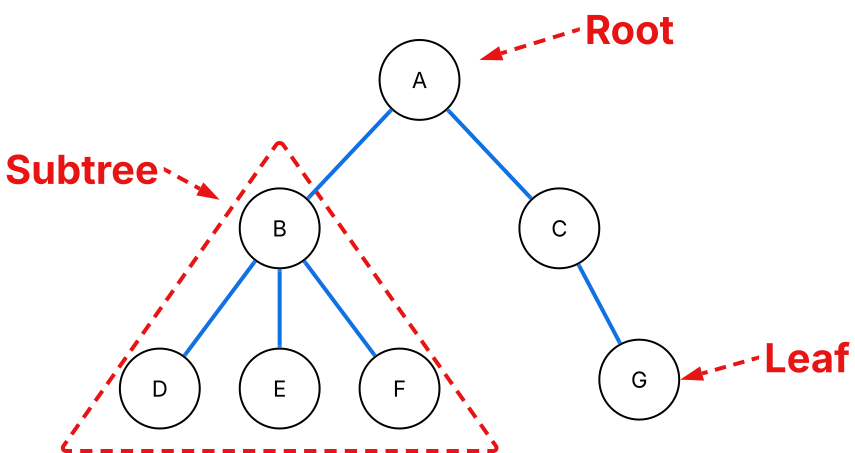
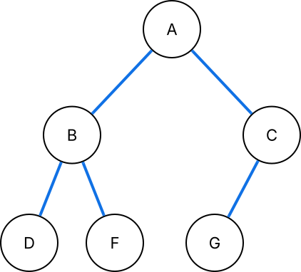
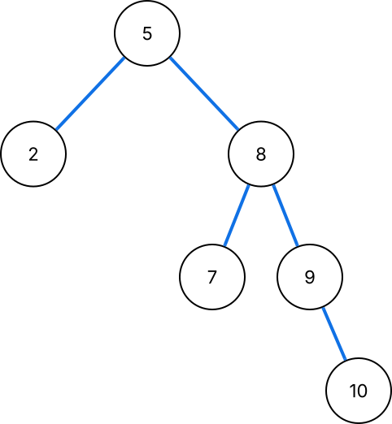
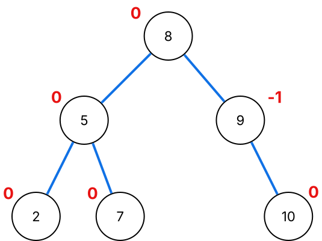
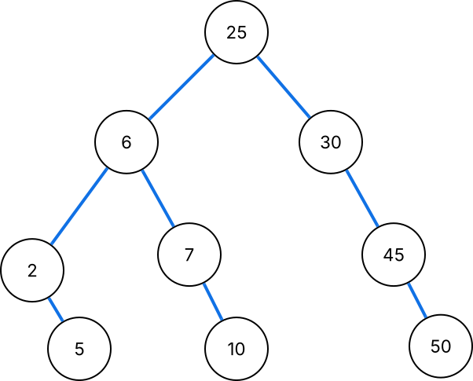
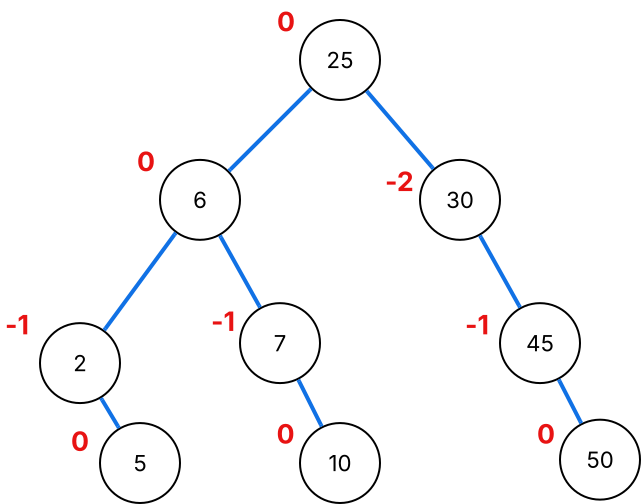

# Trees

## What is a tree?

A tree is an abstract datatype which represents a hierarchical tree like structure consisting of connected nodes. Each node can have children but each node can only have at most one parent. You could think about it like a real tree starting at its base and branching out with everything originating from the base.

- Root: The root of a tree is the top node. The root has no ancestors (is not a child of any other node). The root in the tree above is node `A`.
- Children: A nodes children are the nodes below it that are connected to it. For example in the tree above the children of node `A` are `B` and `C`.
- Parent: A nodes parent is the connected node above it. A node will have only one parent unless it's the root which doesn't have a parent. For example in the above tree the parent of node `D`,`E` and `F` is node `B`.
- Leaf: A leaf is a node that has no children. In the tree above `D`,`E`,`F`,`G` are leaves.
- Ancestor: An ancestor of a node is a node which can be reached by moving up the tree. For example `A` is an ancestor of `G`.
- Descendant: A descendant is a node that can be reached from a node by moving down the tree. For example `E` is a descendant of `B`.
- Height: The height of a node is the longest path downward from a node to a leaf measured by the number of edges. The height of the whole tree is the height of the root node.
- Depth: The depth is the number of ancestors a node has.
- Subtree: Within a tree you can take any node and treat it as a root node making it it's own tree known as a subtree. For example you can make node `B` a root creating a subtree with root `B` and all it's descendants.

## Different tree properties

### Binary tree

A binary tree is a tree where its nodes have at most two children a left child and a right child.

_An example of a binary tree. Every node has no more than two children_

### Binary search tree

A Binary search tree (BST) is a binary tree that follows an additional property. For a node, its left subtree contains only nodes that are less than the parent node. For the nodes in the right subtree all nodes are greater than the parent node.

_An example of a binary search tree. See that nodes less than a node have gone to the left, while greater nodes have gone to the right._

You can search a binary search tree for a node by starting at the root and going left or right depending if the value we are searching for is less than or greater than the node. This is somewhat similar to the approach taken by the binary search algorithm. Although when searching a BST we don't half the number of remaining nodes each time. In a BST the structure is important for the time complexity of search. The average time complexity is $O(\log n)$ but consider a BST where all nodes only have 1 child (except the last which is a leaf). This would be just a diagonal line or left-right zigzag this results in $O(n)$ as we have to search it just how we would with a linked list or unsorted array.

### AVL Trees

An AVL tree further builds on the binary search tree and adds the property that for all nodes the difference in height between the left and right subtrees can be at most 1. For each node a balance factor can be calculated by $h(L)-h(R)$ where $h(L)$ and $h(R)$ give the height of the respective left or right subtree. This factor must be -1, 0 or 1 for all nodes to be an AVL tree. If it is not then the tree must be rebalanced to restore the property.

_An example of a balanced AVL tree. The balance factor for each node given in red. Note this is the previous BST example with a rotation applied to balance the tree_

AVL trees address the time complexity issue with a plain binary search tree by ensuring that the tree remains balanced. This results in a average and worst case time complexity of $O(\log n)$.

::: info Why's it called AVL?
You maybe wondering what AVL stands for. The name AVL comes from the names of it's inventors **A**delson-**V**elsky and **L**andis.
:::

## Exercise

::: tip Exercise!
Test your understanding with this quick exercise.
:::

Given the tree above answer the following:

1. What is the height of this tree?
2. Is `6` an ancestor of `45`?
3. What is the depth of `2`?
4. Does this tree satisfy the properties to be a binary tree?
5. Does this tree satisfy the properties to be a binary search tree?
6. Find the balance factor for each node.
7. Using the balance factors is this tree a balanced AVL tree?

::: details View solutions

1. This tree has a height of 3. This is found by finding the height of the root node. The largest number of edges from the root to a leaf is 3.
2. No, `6` is not an ancestor of `45`. If `6` was an ancestor we would be able to follow the tree up from `45` and reach `6` but it's on the other side of `25` making this not possible.
3. The depth of `2` is two as it has two ancestors.
4. Yes, this tree is a binary tree as each node has at most 2 children.
5. Yes, this tree is a binary search tree. Checking each node we can see that all nodes to the left are less than and nodes to the right are greater than the value of the root of any subtree.
6. The balance factors are given in red:

Balance factors are calculated using $h(L)-h(R)$ where h() returns the height of a subtree and L and R are the subtrees of the node that we are finding the balance factor for. 7. We can see that node `30` has a balance factor of $-2$ breaking the AVL rule meaning that this is not a balanced AVL tree.
:::
