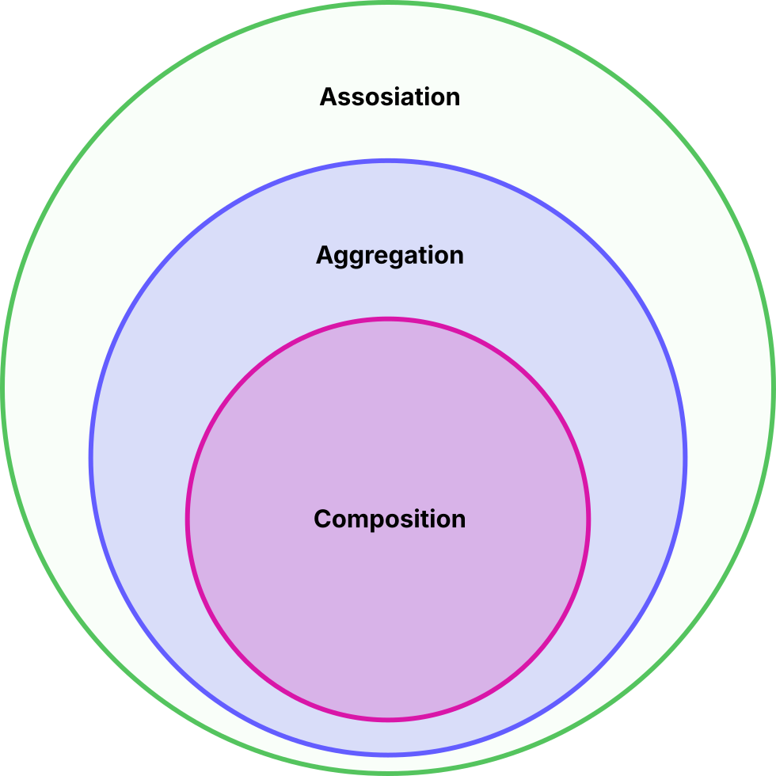
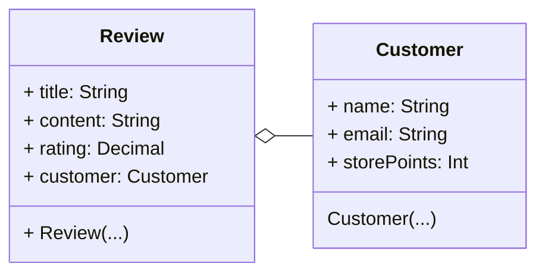
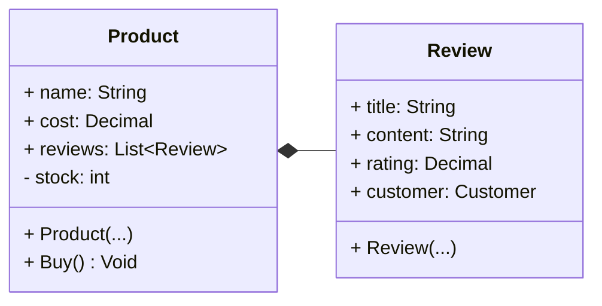

# Aggregation and Composition
There are a range of relationships that we can draw between classes. On this page we will look at Aggregation and Composition.

Aggregation is a subset of association and composition is a further subset of aggregation.
{width=300px}
## Aggregation
Aggregation is when two classes have a relationship but both classes have their own lifecycle. If an object of the parent class is deleted the related object of the child class can still exist.

Here is an example:

Here we see a UML diagram showing the relationship between a Customer and a Review. A review will have a relationship with the customer who wrote the review but if a review is deleted the customer obviously should still exist. The Review is the parent class and the customer is the child of the relationship.

::: tip In UML
Looking at the above UML example we can see that an aggregation relationship is represented by a line with a hollow diamond on one side. The diamond goes on the parent side of the relationship and the child side has no endpoint.
:::

## Composition
Composition is further a subset of aggregation. Composition is a relationship between classes but unlike aggregation the child cannot exist without the parent. It doesn't have it's own lifecycle and will be deleted when the parent is deleted.

Here is an example:

Here we see a UML diagram showing the relationship between a Product and it's reviews. A product has a set of reviews like the reviews are part of the product. If the product is deleted the reviews can't exist by them self and will also be deleted.The product is the parent and the reviews are the children of the relationship.

::: tip In UML
Composition is represented in UML similarly to aggregation except here the diamond on the parent side is solid.
:::