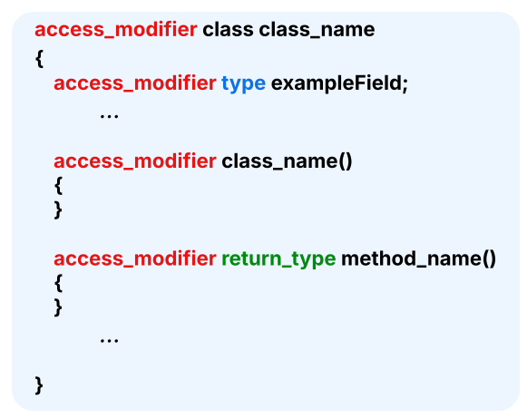
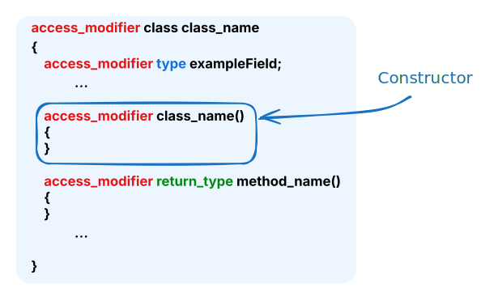

# Class syntax cheatsheet
Maybe you haven't used C# in a while and need a quick refresher. If so this is for you!
## Class
{width=400px}

---

**Access Modifiers**
* `public` - Can be accessed from anywhere
* `private` - Can only be accessed from within this same class
* `protected` - Can be only accessed from it's own class or derived classes.

---

**Types**

The type can be any value type this could be a built-in type or a custom class or data structure.

Common built-in types include:
* `int`
* `bool`
* `double`
* `string`

A full list of built-in types can be found [here](https://learn.microsoft.com/en-us/dotnet/csharp/language-reference/builtin-types/built-in-types)

---

**Return Types**

The return type is the type which is returned by the method. This can be any value type or `void` if the method returns nothing.

---

### Constructor
{width=400px}

The constructor is the method called to create an object of a class. It can take arguments and used to setup the class.