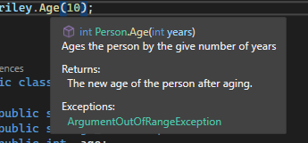
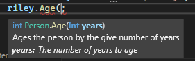

# XML Documentation
## What is XML documentation
In C# there is a special kind of comment you can write which uses a XML structure. These comments allow you to document your classes and methods using a set structure. This structure can be read by a range of tools which will present this information to developers in intuitive ways.

::: tip Note
This isn't covered within the unit but it is something you can apply when creating classes and methods. It can also be applied within some tasks.
:::

For example Visual Studio will read these documentation comments and show them to you in a nice formatted way as you type or hover over methods and classes.
{width=300px}

{width=300px}

Here we can see that VS read the XML documentation I wrote for the method and then provided it to me with helpful information such as what the function does, what arguments it takes, what it returns and what exceptions it can throw.

This is very helpful as it gives you information about what you are using without having to go look back at the code or external documentation. This is especially helpful when other people use your code as they won't understand and shouldn't need to deeply understand the inner workings of your code.

## How to write XML documentation
So! How do we actually write this documentation?

Lets start with the basics. It's probably easiest to look at a simple example first:

```C#
/// <summary>
/// Prints Hello! to the terminal.
/// </summary>
public void Print()
{
    Console.WriteLine("Hello!");
}
```

Here we see the basics of XML documentation. Unlike normal comments documentation uses three slashes.
As you probably guessed XML is used to structure these. Tags are used to give different kinds of information. Each tag has a opening and closing tag and the content is place between these tags.

In this example you can see the `<summary>` tag which is the most common tag you will see. All documentation usually starts with this tag, it provides a short description of what it is documenting.

Other than the summary tag we have many others. Common tags include:
* `<summary>` - Short description of what is being documented. Considered the minimum for documentation.
* `<param>` - Document a parameter for a method.
* `<returns>` - Document what a method returns.
* `<exception>` - Document an exception that can be thrown.

::: tip Tip!
In Visual Studio if you type `\\\` above a method or class it will automatically generate a XML documentation template with all the fields you should need to document your method/class. Then all you have to do is fill in the blanks!
:::

Some tags such as `<param>` and `<exception>` take arguments within the tag to tell what parameter or exception they are referring to. This is probably easier to understand by looking at the example.

Here's an example of how XML documentation be be used with a class. This doesn't contain the best content but hopeful it should give you a good idea of how this documentation is laid out.

```C#
/// <summary>
/// Class for a person
/// </summary>
public class Person
{
    public string _firstName;
    public string _lastName;
    public int _age;

    /// <summary>
    /// Constructor for the person class. When created the persons age will be set to zero.
    /// </summary>
    /// <param name="fname">The first name of the person</param>
    /// <param name="lname">The last name of the person</param>
    public Person(string fname, string lname)
    {
        _firstName = fname;
        _lastName = lname;
        _age = 0;
    }

    /// <summary>
    /// Prints a greeting from the person using their first and last name to the console.
    /// </summary>
    public void Greet()
    {
        Console.WriteLine($"Hello! I'm {_firstName} {_lastName}");
    }


    /// <summary>
    /// Ages the person by the give number of years.
    /// </summary>
    /// <param name="years">The number of years to age</param>
    /// <returns>The new age of the person after aging.</returns>
    /// <exception cref="ArgumentOutOfRangeException">The number of years to age must be postive. You can't age negative years!</exception>
    public int Age(int years)
    {
        if(years < 0)
        {
            throw new ArgumentOutOfRangeException("Years can't be negative!");
        }
        _age += years;

        return _age;
    }
}
```
## Where else XML documentation is used
Apart from just being used in your IDE like we covered in this page XML documentation is also used in many other useful ways.

All XML documentation can be copied by the compiler into a separate documentation file during compilation. This is helpful when compiling libraries to .dll files (or similar). This is because when compiled all comments will be lost and the code will no longer be easily readable, so the documentation file can be distributed along side the .dll allowing users of the library to still get helpful documentation of the compiled library they are using.

Tools can also be used to read through your XML documentation and generate external documentation resources such as LaTex pages, PDFs and web pages.

## Further reading
Now that you have a basic understanding of XML documentation why not have a look at the list of recommend tags from Microsoft: [Recommended XML tags for C# documentation comments](https://learn.microsoft.com/en-us/dotnet/csharp/language-reference/xmldoc/recommended-tags)

Happy documenting!