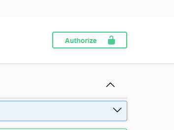
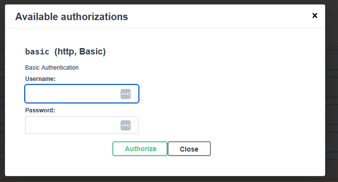
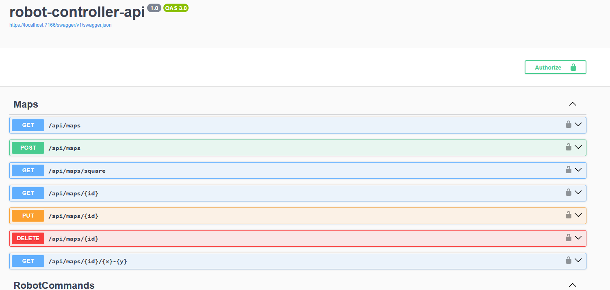
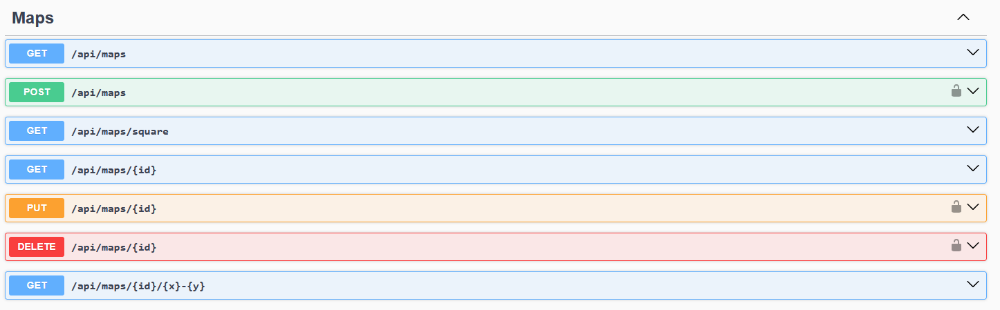
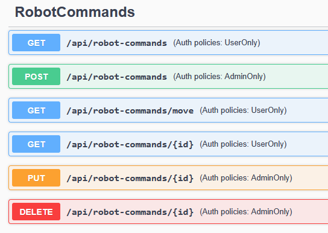

# Adding authentication in Swagger

If you continued to make use of Swagger when implementing 6.1 Authentication and Authorization you probably noticed that it kind of works. When you try to send a request the browser login box appears and you can authenticate. This is then saved for future requests you make on the page.

While this works it would be nice to have a way to add and change your credentials inside Swagger while exploring the API. Further more it would be cool to be able to see what endpoints need authentication.

So lets get started!

## Authentication for all!

Before we start have a look at the how basic authentication can be described within the OpenAPI specification: [Basic Authentication](https://swagger.io/docs/specification/v3_0/authentication/basic-authentication/). This will help you understand what information needs to be generated.

After briefly reading through the page you'll know that to add authentication we first need to create a security scheme. You'll also see how a security scheme can be applied to the entire API or certain endpoints/operations.

But how can this be implemented within Swashbuckle?

Looking back at `builder.Services.AddSwaggerGen();` in `Program.cs` we can see that we where able to add information such as title, description and contact info using `SwaggerDoc`. We can do a similar thing to add a security scheme.

```C#
builder.Services.AddSwaggerGen(options =>
{
    options.AddSecurityDefinition("basicAuth", new OpenApiSecurityScheme
    {
        Type = SecuritySchemeType.Http,
        Scheme = "basic",
        Description = "Basic Authentication"
    });

    //Rest of your config ...
});
```

The code above adds a new security scheme with the name `basicAuth` (this name can be anything, as long as it is informative), the type is a HTTP authentication scheme (meaning a scheme that makes use of the `Authorization` header), the scheme is `basic` as we are using basic authentication and a description that gives information about this scheme.

If you add this to your code when you go to swagger you should see a Authorize button at the top of the page.



Clicking on it brings up a dialog that allows you to enter credentials.



But if you add your credentials and try any of your endpoints you'll realize that it's not working. This is because while we have created a security schema we still need to tell swagger to use it.

To do this we need to add more to our options.

```C#
builder.Services.AddSwaggerGen(options =>
{
    options.AddSecurityDefinition("basicAuth", new OpenApiSecurityScheme
    {
        Type = SecuritySchemeType.Http,
        Scheme = "basic",
        Description = "Basic Authentication"
    });

    options.AddSecurityRequirement(document => new OpenApiSecurityRequirement
    {
        [new OpenApiSecuritySchemeReference("basicAuth", document)] = []
    });

    //Rest of your config ...
});
```

`AddSecurityRequirement()` Adds a global security requirement meaning that it will be applied to all endpoints. Notice that we make reference to `basicAuth` within this. `basicAuth` is the name of the security schema we created so we are saying all endpoints require the schema. You can give the schema any name but it's good to keep it informative. If you want to get advanced you can even create multiple different security schemas if your API supports multiple authentication methods.

Now if we again check swagger.


We can see all endpoints have a little lock next to them as they require authentication. If you now add credentials and send a request Swagger will send the credentials along with the request.

## Per endpoint authentication documentation

If you completed the optional steps in the task you would have also added support for the `[AllowAnonymous]` attribute which allowed for some endpoints to be accessed without authentication. Since we applied the security schema globally swagger will show that all endpoints need authentication even if some don't.

To overcome this we need a way to instead add the rule per endpoint. There isn't a built in way to do this within Swashbuckle.AspNetCore but we can make use of an [Operation Filter](https://github.com/domaindrivendev/Swashbuckle.AspNetCore/blob/master/docs/configure-and-customize-swaggergen.md#extend-generator-with-operation-schema-and-document-filters) to add the security rule our self depending on whether the endpoint has the Authorize annotation.

If you want you can code your own filter to do this, but there is also a package `Swashbuckle.AspNetCore.Filters` which is a collection of helpful pre-made filters.
It can be added using:

```bash
dotnet add package Swashbuckle.AspNetCore.Filters
```

One of the filters included is `SecurityRequirementsOperationFilter` which is exactly what we need. It checks if an operation has the `Authorize` annotation and if it does adds a given security scheme. It can also add Unauthorized and Forbidden responses to endpoints with authorization.

With the package installed lets add this filter to our project. First remove the `options.AddSecurityRequirement()` from before as we no longer want to apply the security globally. Then add the operation filter:

```C#
builder.Services.AddSwaggerGen(options =>
{
    options.AddSecurityDefinition("basicAuth", new OpenApiSecurityScheme
    {
        Type = SecuritySchemeType.Http,
        Scheme = "basic",
        Description = "Basic Authentication"
    });

    options.OperationFilter<SecurityRequirementsOperationFilter>(true, "basicAuth"); //Adds the filter


    //Rest of your config ...
});
```

Notice that we pass two parameters. The bool sets whether we want to add the Unauthorized and Forbidden responses. The string is what our security scheme is called, so it should match the name we gave in `options.AddSecurityDefinition()`.

If your interested to see how the filter works you can look at it's code here: [SecurityRequirementsOperationFilterT.cs](https://github.com/mattfrear/Swashbuckle.AspNetCore.Filters/blob/master/src/Swashbuckle.AspNetCore.Filters/SecurityRequirementsOperationFilter/SecurityRequirementsOperationFilterT.cs). It's pretty simple and may give you some ideas on making your own filters in the future if you want.

Now with the filter added lets take a look at Swagger again.


Now we can see that authentication is only required for endpoints with the annotation.

## Add authorization policies.

`Swashbuckle.AspNetCore.Filters` has another filter which I think is pretty cool `AppendAuthorizeToSummaryOperationFilter`. This filter takes the content given in your authorize annotation and adds it to the summary of a endpoint. This adds the policies of each endpoint to the summary which is definitely useful for the documentation as it tells us who can access certain endpoints.

It is added just like the last filter:

```C#
builder.Services.AddSwaggerGen(options =>
{
    options.AddSecurityDefinition("basicAuth", new OpenApiSecurityScheme
    {
        Type = SecuritySchemeType.Http,
        Scheme = "basic",
        Description = "Basic Authentication"
    });

    options.OperationFilter<SecurityRequirementsOperationFilter>(true, "basicAuth");

    options.OperationFilter<AppendAuthorizeToSummaryOperationFilter>(); //New filter

    //Rest of your config ...
});
```

Going back to Swagger we can now see the authorization policies!


Now we have greatly improved the documentation of authentication and authorization within Swagger! Hopefully this also gives you an idea of how you can further customize your documentation using more advanced features such as filters.
