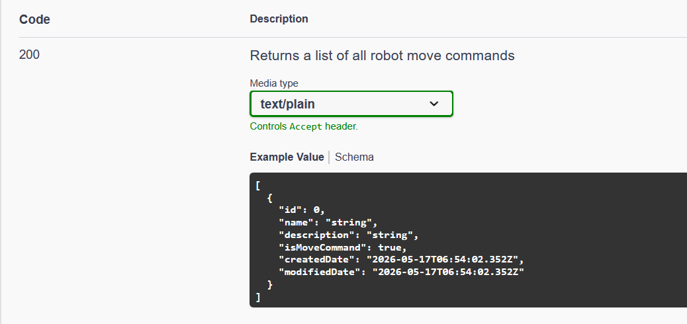
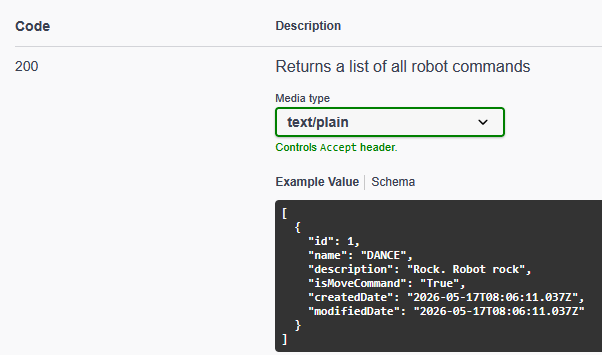
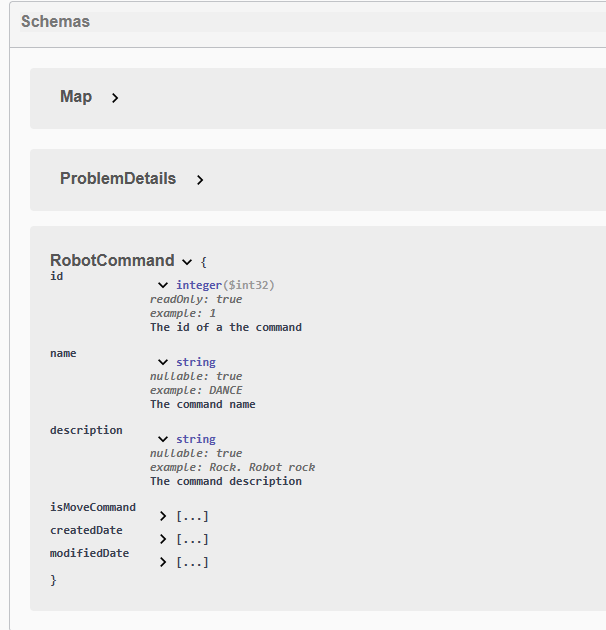
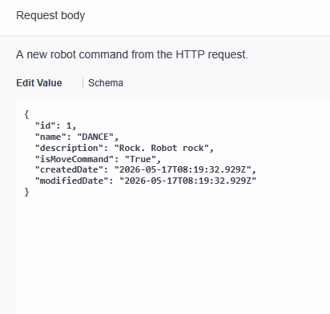
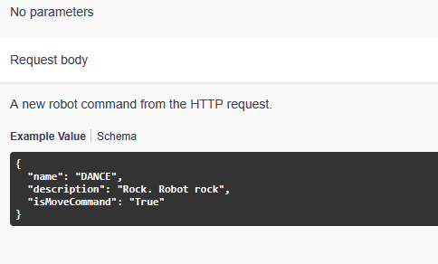

# Additional documentation for swagger schemas

When completing 5.1P you may have noticed that the example data that swagger shows for a schema is pretty vague and not very helpful.

Here we can see that the provided example response isn't very informative.

This uninformative data is also used when swagger prefills request body data when you click the _'Try it out'_ button, and
in the bottom schemas section.

It would definitely be nice if we could customize the example values!

## Adding XML documentation to your classes

Luckily this is possible and really simple to do! Just like when documenting endpoints, XML documentation can be added to each of the properties in a class or record.

::: tip Need a refresher?
Need a refresher on how XML documentation works? Check out: [SIT232 - XML Documentation](/sit232/csharp/xml_documentation.md). This was written for SIT232 but still gives a good overview of the basics.
:::

There are 2 main XML tags that you can add to each property: `<example>` and `<summary>`

As you have probably guessed `<example>` is what really solves the problem. It allows us to provide an example value for a given property.
The `<summary>` is also helpful as it allows us to provide a short description which can be seen when viewing the schema in Swagger.

Here is a partial version of a RobotCommand class:

```C#
public class RobotCommand
{
    public int Id { get; set; }

    public string Name { get; set; }

    public string? Description { get; set; }
}
```

Currently it contains no documentation so we just get the generic examples within Swagger. But if we add some XML documentation...

```C#
public class RobotCommand
{
    /// <summary>
    /// The id of a the command
    /// </summary>
    /// <example>1</example>
    public int Id { get; set; }

    /// <summary>
    /// The command name
    /// </summary>
    /// <example>DANCE</example>
    public string Name { get; set; }

    /// <summary>
    /// The command description
    /// </summary>
    /// <example>Rock. Robot rock</example>
    public string? Description { get; set; }
}
```



We can now see the custom provided examples are being used!

Looking in the schema dropdown we can see that the summaries and examples have also been included here


## Swashbuckle.AspNetCore.Annotations

Success! We've now added more relevant examples, but there is another issue you may want to fix.
Have a look at the initial request body when the _'Try it out'_ button is clicked.



Properties such as the id and timestamps are included despite them being read only. The client shouldn't send these and they'll just be disregarded so including them might confuse someone reading the documentation. There are a few ways this issue can be fixed, one of them being Swashbuckle.AspNetCore.Annotations .

Swashbuckle.AspNetCore.Annotations is an addon to Swashbuckle.AspNetCore which allows additional attributes to be used which can enrich your documentation.

Swashbuckle.AspNetCore.Annotations isn't included within the core package so it has to be downloaded separately. This can be done using the following command:

```bash
dotnet add package Swashbuckle.AspNetCore.Annotations
```

Then before we can start using Annotations it first has to be enabled within `AddSwaggerGen`

```C#
builder.Services.AddSwaggerGen(options =>
{
    options.EnableAnnotations();

    //Rest of your config ...
});
```

Once enabled you are able to add a range of new annotations which allow you to do a lot of different things. You can learn about most of them here: [Configuration and Customization of Swashbuckle.AspNetCore.Annotations](https://github.com/domaindrivendev/Swashbuckle.AspNetCore/blob/master/docs/configure-and-customize-annotations.md). Note some attributes are undocumented if you want to learn more you can look at the files names and code to learn about all the possible annotations.

Now back to solving our problem!
One of the added annotations is `[SwaggerSchema()]` this allows us add OpenAPI Schema to a class or property.

Since we want to hide fields from the request bodies we can use this to tell Swagger it is read only. This is done using `[SwaggerSchema(ReadOnly = true)]`.

Lets add this annotation to all the fields we need for our robot command:

```C#
public class RobotCommand
{
    /// <summary>
    /// The id of a the command
    /// </summary>
    /// <example>1</example>
    [SwaggerSchema(ReadOnly = true)]
    public int Id { get; set; }

    /// <summary>
    /// The command name
    /// </summary>
    /// <example>DANCE</example>
    public string Name { get; set; }

    /// <summary>
    /// The command description
    /// </summary>
    /// <example>Rock. Robot rock</example>
    public string? Description { get; set; }
}
```

Now if we check Swagger again we can see the fields we marked as read only no longer show on in request body examples but still exist within responses.


If you are interested on what other keywords you can set within the annotation have a look at the OpenAPI specification which can be found here: [Supported JSON Schema Keywords](https://swagger.io/docs/specification/v3_0/data-models/keywords/)

Success! We managed to further improve our documentation making it easier for others (and maybe ourselves) to understand and utilize the APIs we make.

::: tip Extension
A cool feature of Swashbuckle.AspNetCore is SchemaFilters! They allow you dynamically configure information about a schema including adding examples.

When using Swashbuckle.AspNetCore.Annotations you can also apply different SchemaFilters to a schema by adding a attribute to the schemas class or record.
A similar interface exists for operations allowing you to do the same with operations.

Learn more about filters: [Extend Generator with Operation, Schema and Document Filters](https://github.com/domaindrivendev/Swashbuckle.AspNetCore/blob/master/docs/configure-and-customize-swaggergen.md#extend-generator-with-operation-schema-and-document-filters)

Apply filters using attributes: [Apply Schema Filters to Specific Types](https://github.com/domaindrivendev/Swashbuckle.AspNetCore/blob/master/docs/configure-and-customize-annotations.md#apply-schema-filters-to-specific-types)
:::
